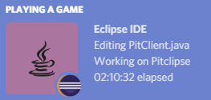

# Discord Rich Presence for Eclipse IDE

[](https://travis-ci.org/echebbi/eclipse-discord-integration) [](https://discord-rich-presence-for-eclipse-ide.readthedocs.io/en/latest/?badge=latest) [](https://sonarcloud.io/dashboard?id=fr.kazejiyu.discord.rpc.integration%3Afr.kazejiyu.discord.rpc.integration.root) [](https://codecov.io/gh/echebbi/eclipse-discord-integration) [](https://sonarcloud.io/dashboard?id=fr.kazejiyu.discord.rpc.integration%3Afr.kazejiyu.discord.rpc.integration.root) [](https://marketplace.eclipse.org/content/discord-rich-presence-eclipse-ide) [  ](https://bintray.com/kazejiyu/eclipse-discord-integration/releases/_latestVersion)

## Presentation

Discord Rich Presence for Eclipse IDE is a plug-in that uses [Rich Presence](https://discordapp.com/rich-presence) in order to display information related to your current work in Discord.

Here is an example of the Rich Presence Integration:

<div align="center">
  
</div>

> **!** Please [take a look at the documentation](https://discord-rich-presence-for-eclipse-ide.readthedocs.io/en/latest/) for further information about installation, use and customizations.

## Installation

### From the update site
The plug-in can be installed from the following update site:

- [https://dl.bintray.com/kazejiyu/eclipse-discord-integration/updates/](https://dl.bintray.com/kazejiyu/eclipse-discord-integration/updates/)

To use it from Eclipse IDE, click on `Help` > `Install new software...` and then paste the above URL.

### From the Eclipse Marketplace

The plug-in is also available in the [Eclipse Marketplace](https://marketplace.eclipse.org/content/discord-rich-presence-eclipse-ide).

Drag the following button to your running Eclipse workspace to start the installation:
<div align="center">
  <a href="http://marketplace.eclipse.org/marketplace-client-intro?mpc_install=4240174" class="drag" title="Drag to your running Eclipse* workspace. *Requires Eclipse Marketplace Client"></a>
</div>

## Troubleshooting

### Discord does not detect Eclipse IDE as a game

If Discord is not showing anything, ensure that Eclipse IDE is detected as a game. To this end, open Discord `User Settings` then go the `Games` tab. Click on the `Add it!` button and then select Eclipse IDE.

### A 'Workbench early startup error' occurs since the plug-in is installed

In case you encounter the following error on startup:
```
An internal error occurred during: "Workbench early startup".

There is an incompatible JNA native library installed on this system
Expected: 5.1.0
Found: 4.0.1
```
you can try to modify the _eclipse.ini_ file which is located next to _eclipse.exe_ in order to set the `jna.nosys` property to true as follows:
```
-vmargs
-Djna.nosys=true
```

> The `-vmargs` line should already exist, otherwise you can append it at the end of the file.

## Deactivate Discord Rich Presence

Once the plug-in is installed, Discord Rich Presence is automatically started on Eclipse startup. As a result, Discord displays **Playing Eclipse IDE** as a status message as soon as Eclipse IDE is opened. This behavior may not be desirable but can be easily deactivated.

1. Open Eclipse Preferences (`Window` > `Preferences`)
2. Open the plug-in's page (`Discord Rich Presence`)
3. Uncheck _Activate Rich Presence Integration_
4. Click on _Apply_

From that time on, Discord won't be notified anymore by Eclipse IDE. In order to re-activate Rich Presence, follow the steps above and check _Activate Rich Presence Integration_ again.

## Changelog

See [CHANGELOG.md](CHANGELOG.md).

## Contributing

See [CONTRIBUTING.md](CONTRIBUTING.md).

## License

The Discord Rich Presence for Eclipse IDE plug-in is licensed under the [Eclipse Public License 2.0](https://www.eclipse.org/legal/epl-2.0/).

It uses different third-party components which are licensed under:
- the Apache Public License 2.0
  - [java-discord-rpc](https://github.com/MinnDevelopment/java-discord-rpc) Copyright (c) 2016 - 2019 Florian Spieß and the java-discord-rpc contributors
- the MIT License (MIT)
  - [fileicons-render](https://github.com/HelloWorld017/fileicons-render) Copyright (c) 2014

## Thanks

- [MinnDevelopment](https://github.com/MinnDevelopment) for [its Java implementation](https://github.com/MinnDevelopment/java-discord-rpc) of Discord RPC.
- [Lorenzo Bettini](https://github.com/LorenzoBettini) for his explanations on [how to publish a p2 composite repository on Bintray](http://www.lorenzobettini.it/2016/02/publish-an-eclipse-p2-composite-repository-on-bintray/).
 - [HelloWorld017](https://github.com/HelloWorld017/) for [his adaptation](https://github.com/HelloWorld017/fileicons-render) of [programming language icons](https://github.com/file-icons/atom). These icons are displayed on Discord according to the programming language of the current file.
