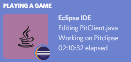

Change language icons
=====================

Motivation
----------

By default, the icon displayed on Discord is a flat icon of the programming language used in the active editor. Since the programming language is usually determined upon the edited file's extension, editing a ``*.java`` file will show a Java icon on Discord:

However, you may want to use custom icons, because the default ones don't suit you or because you'd like the icon to represent the project you're working on instead of the programming language you're using:

.. image:: images/custom_icon.png
    :align: center
    :alt: Example of a Rich Presence with a custom icon

.. admonition:: Credit

          | Icon by `Chanut is Industries <https://www.iconfinder.com/Chanut-is>`_
          | Published on `IconFinder <https://www.iconfinder.com/icons/2913096/castle_fantasy_fortress_kingdom_medieval_rpg_stronghold_icon>`_
          | Under the `Creative Commons (Attribution 3.0 Unported) licence <https://creativecommons.org/licenses/by/3.0/legalcode>`_

Limitations due to Discord API
------------------------------

Ideally, you would just have to provide the plug-in a set of icons and *voilà*, you would be done. However, at the moment Discord does not provide any API allowing developers to programmatically upload new icons. To overcome this limitation, here is what you have to do:

1. Create a Discord application
2. Upload your custom icons on this application
3. Ask the *Discord Rich Presence for Eclipse IDE* plug-in to use your own Discord application

The following section explains step by step how to proceed.

Create a Discord application
----------------------------

1. Connect to the `Discord Developer Portal <https://discordapp.com/developers/applications/>`_. You'll have to login with your Discord credentials.

2. Click on the ``New Application`` button, on the top-right of the screen.

3. Type the name of your application. It will be shown on Discord instead of *Eclipse IDE* (which is the name of the default Discord application used by the plug-in).

4. Click on ``Create``.

5. The main page of the application should open. Click on the *Rich Presence* item, which is in the menu navigation on the left.

6. Click on ``Add Image(s)`` in the ``RICH PRESENCE ASSETS`` section.

7. A dialog should open. Select the icons you want to use then validate.

8. A list of all the icons you selected should be displayed below. In order to register the icons, you still have to give each of them an ID. This ID is used by the Eclipse plug-in to select the right icon for the right language. See the table below for a list of available IDs.

9. Click on ``Save Changes``.

+-------------------+-------------------------------------------------+
| ID                | File patterns                                   |
+===================+=================================================+
| ada               | \*.ada                                          |
+-------------------+-------------------------------------------------+
| binary            | \*.bin                                          |
+-------------------+-------------------------------------------------+
| boo               | \*.boo                                          |
+-------------------+-------------------------------------------------+
| clojure           | \*.clj                                          |
+-------------------+-------------------------------------------------+
| cobol             | \*.cob, \*.cbl, \*.cpy                          |
+-------------------+-------------------------------------------------+
| c                 | \*.c, \*.h                                      |
+-------------------+-------------------------------------------------+
| cpp               | \*.cpp, \*.hpp                                  |
+-------------------+-------------------------------------------------+
| crystal           | \*.cr                                           |
+-------------------+-------------------------------------------------+
| css3              | \*.css                                          |
+-------------------+-------------------------------------------------+
| csharp            | \*.cs                                           |
+-------------------+-------------------------------------------------+
| dart              | \*.dart                                         |
+-------------------+-------------------------------------------------+
| docker            | Dockerfile                                      |
+-------------------+-------------------------------------------------+
| fortan            | \*.f, \*.for, \*.f90, \*.f95, \*.f03            |
+-------------------+-------------------------------------------------+
| git               | \*.git, .gitignore, .gitattributes, .gitmodules |
+-------------------+-------------------------------------------------+
| go                | \*.go                                           |
+-------------------+-------------------------------------------------+
| gradle            | \*.gradle                                       |
+-------------------+-------------------------------------------------+
| groovy            | \*.gvy, \*.gy, \*.gsh                           |
+-------------------+-------------------------------------------------+
| haskell           | \*.hs                                           |
+-------------------+-------------------------------------------------+
| html5             | \*.html                                         |
+-------------------+-------------------------------------------------+
| java              | \*.java                                         |
+-------------------+-------------------------------------------------+
| js                | \*.js                                           |
+-------------------+-------------------------------------------------+
| kotlin            | \*.kt, \*.ktm, \*.kts                           |
+-------------------+-------------------------------------------------+
| bibtex            | \*.tex                                          |
+-------------------+-------------------------------------------------+
| lisp              | \*.lisp, \*.lsp                                 |
+-------------------+-------------------------------------------------+
| lua               | \*.lua                                          |
+-------------------+-------------------------------------------------+
| markdown          | \*.markdown, \*.mdown, \*.md                    |
+-------------------+-------------------------------------------------+
| ocaml             | \*.ml, \*.mli                                   |
+-------------------+-------------------------------------------------+
| pascal            | \*.pas                                          |
+-------------------+-------------------------------------------------+
| php               | \*.php                                          |
+-------------------+-------------------------------------------------+
| prolog            | \*.pro, \*.pl                                   |
+-------------------+-------------------------------------------------+
| python            | \*.py                                           |
+-------------------+-------------------------------------------------+
| r                 | \*.r                                            |
+-------------------+-------------------------------------------------+
| ruby              | \*.rb                                           |
+-------------------+-------------------------------------------------+
| rust              | \*.rs, \*.rlib                                  |
+-------------------+-------------------------------------------------+
| scala             | \*.scala, \*.sbt                                |
+-------------------+-------------------------------------------------+
| sql               | \*.sql                                          |
+-------------------+-------------------------------------------------+
| swift             | \*.swift                                        |
+-------------------+-------------------------------------------------+
| terminal          | \*.sh, \*.bash, \*.ksh                          |
+-------------------+-------------------------------------------------+
| text              | \*.txt                                          |
+-------------------+-------------------------------------------------+
| ts                | \*.ts                                           |
+-------------------+-------------------------------------------------+

Configure the plug-in to use your application
---------------------------------------------

Once your Discord application is ready you have to ask the Eclipse plug-in to use it:

1. Open Eclipse IDE
2. Click on ``Windows`` > ``Preferences``
3. Select ``Discord Rich Presence`` > ``Icons``
4. The following page should open:

5. Check ``Use custom application``
6. Specify the ID of your application (it's the ``Client ID`` field in your Discord application's main page)
7. Click on ``Apply``

Discord should be updated with your own icons!

.. tip:: A custom Discord application can also be specified :ref:`per project <part-project-scope-preferences>`.