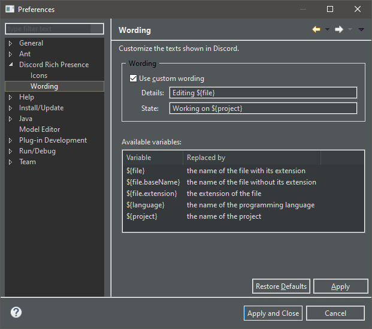

Change wording
=====================

Motivation
----------

By default, the plug-in uses the following sentences: *Editing <file name>* and *Working on <project>*:

.. image:: ../images/rich_presence_example.png
    :align: center
    :alt: Example of a Rich Presence showing a Java icon

Provide custom templates
------------------------

However, they may not fit your needs. Hopefully you can specify your own sentences from the preferences page: 

1. Click on ``Window`` > ``Preference``
2. Select ``Discord Rich Presence`` > ``Wording``
3. The following page should open:

4. Check ``Use custom wording``
5. Fill the *Details* and *State* fields with your own templates

.. tip:: In Discord, *Details* is the top text and *State* the bottom text. See also `Discord's Rich Presence documentation <https://discordapp.com/developers/docs/rich-presence/how-to#updating-presence-update-presence-payload-fields>`_.

The following variables can be used in the templates:

+-----------------------+-------------------------------------------------+
| Variable              | Replaced by                                     |
+=======================+=================================================+
| ``${file}``           | the name of the file with its extension         |
+-----------------------+-------------------------------------------------+
| ``${file.baseName}``  | the name of the file without its extension      |
+-----------------------+-------------------------------------------------+
| ``${file.extension}`` | the extension of the file                       |
+-----------------------+-------------------------------------------------+
| ``${language}``       | the name of the programming language            |
+-----------------------+-------------------------------------------------+
| ``${project}``        | the name of the project                         |
+-----------------------+-------------------------------------------------+

The wording can also be customize per project:

1. Right-click on a project > ``Properties``
2. Select ``Discord Rich Presence`` > ``Wording``