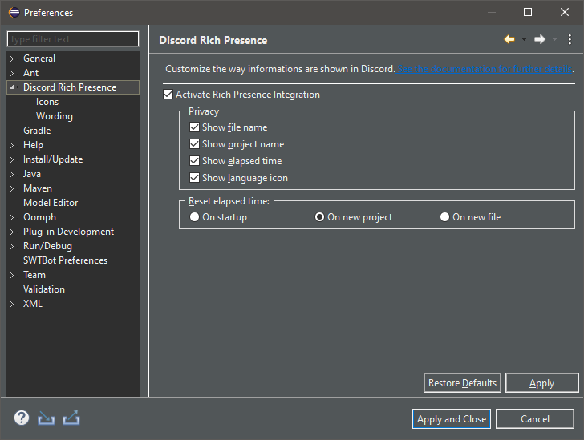
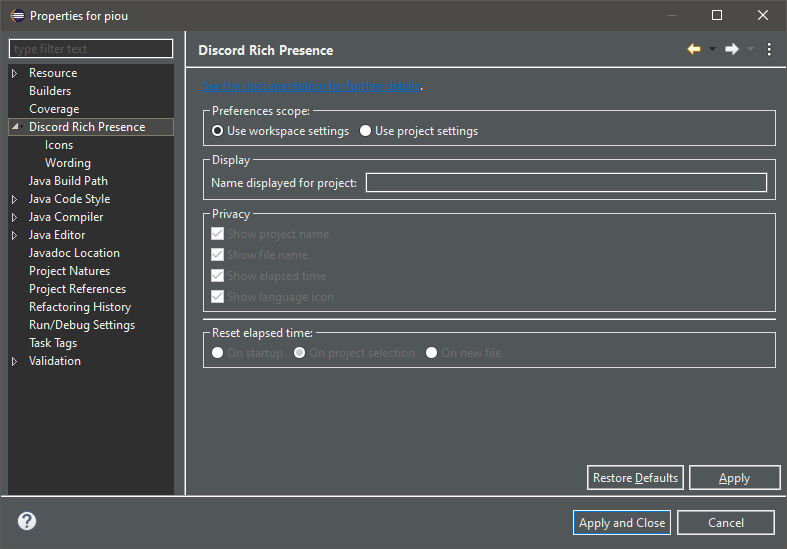

Differentiate global and project scopes
=======================================

The *Discord Rich Presence for Eclipse IDE* plug-in offers numerous preferences allowing you to choose the information to show on Discord. Most of these preferences can be changed at both global and project scope.

.. _part-global-scope-preferences:

Global scope
------------

Preferences changed at the global scope are applied to all the projects in the active workspace. They are not shared between workspaces so different workspaces can have different global preferences.

Those preferences can be edited through the *Preferences* dialog:

1. Go to ``Window`` > ``Preferences``
2. Click on ``Discord Rich Presence``
3. The following page should open:

See the different sections on the left menu to discover what can be customized.

.. _part-project-scope-preferences:

Project scope
--------------

Preferences changed at the project scope are only applied to one project. They have precedence over global scope.

Those preferences can be edited through the *Project Settings* dialog:

1. Right-click on a project > ``Properties``
2. Click on ``Discord Rich Presence``
3. The following page should open:

By default each project uses the global preferences (notice the ``Use workspace settings`` checkbox). In order to set the preferences at the project-scope you have to check the ``Use project settings`` checkbox.