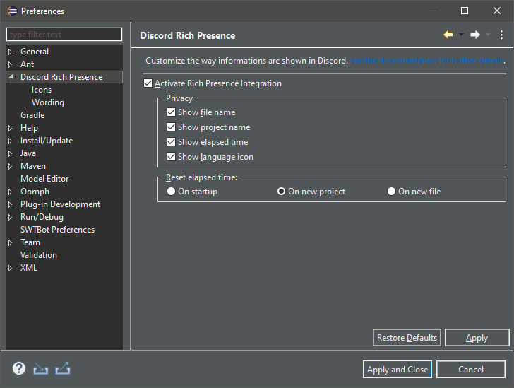

Hide some information
======================

Plug-in's preferences allow you to prevent some information to be shown on Discord. These preferences can be set at both :ref:`global and project scopes <part-global-scope-preferences>`.

Open the preferences page and take a look at the *Privacy* section:

The checkboxes allow you to select whether the following information should be shown on Discord:

- the name of the edited file,
- the name of the edited file's project,
- the time elapsed working,
- the icon of the edited file's programming language.