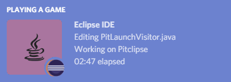

===================================================
Discord Rich Presence for Eclipse IDE
===================================================

The *Discord Rich Presence for Eclipse IDE* is a plug-in for Eclipse IDE that shows on Discord the projects and files you're currently working on:

This plug-in can be installed on any application and IDE based on Eclipse Mars 1 or newer. Please see the following table of contents for instructions on how to install the plug-in, change its preferences or extend it.

.. tip:: See also the sources on `GitHub <https://github.com/echebbi/eclipse-discord-integration>`_!

Table of Contents
-----------------

.. toctree::
   :maxdepth: 2
   :caption: Install the plug-in

   install/from-marketplace
   install/from-p2

.. toctree::
   :maxdepth: 2
   :caption: Customize the plug-in

   customize/global-and-project-scopes
   customize/change-name-of-projects
   customize/change-wording
   customize/change-language-icons
   customize/hide-information
   customize/deactivate-plugin

.. toctree::
   :maxdepth: 2
   :caption: Extend the plug-in

   extend/support-new-editors
   extend/change-wording

.. toctree::
   :maxdepth: 2
   :caption: Contribute to the plug-in

   contribute/contributing-guide

.. toctree::
   :maxdepth: 2
   :caption: Troubleshooting

   troubleshooting/not-detected-as-game
   troubleshooting/workbench-early-startup-error